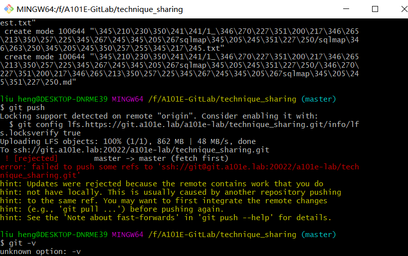

# Git克隆含有LFS（Large File Storage, 大文件存储）对象的仓库

- git克隆完含有LFS的仓库后，`push`不上去


- 遇到仓库文件过大导致拉取过慢的问题
- 使用 Git LFS 的核心思想就是把需要进行版本管理、但又占用很大空间的那部分文件独立于 Git 仓库进行管理。从而加快克隆仓库本身的速度，同时获得灵活的管理 LFS 对象的能力。
  - 只获取仓库本身，而不获取任何 LFS 对象

  ``` bash
  GIT_LFS_SKIP_SMUDGE=1 git clone https://gitee.com/user/repo.git
  # 或
  git -c filter.lfs.smudge= -c filter.lfs.required=false clone https://gitee.com/user/repo.git
  ```

**参考链接**  
[Git LFS 操作指南-Gitee](https://gitee.com/help/articles/4235#article-header7)  
[How to clone/pull a git repository, ignoring LFS?-stackoverflow](https://stackoverflow.com/questions/42019529/how-to-clone-pull-a-git-repository-ignoring-lfs)