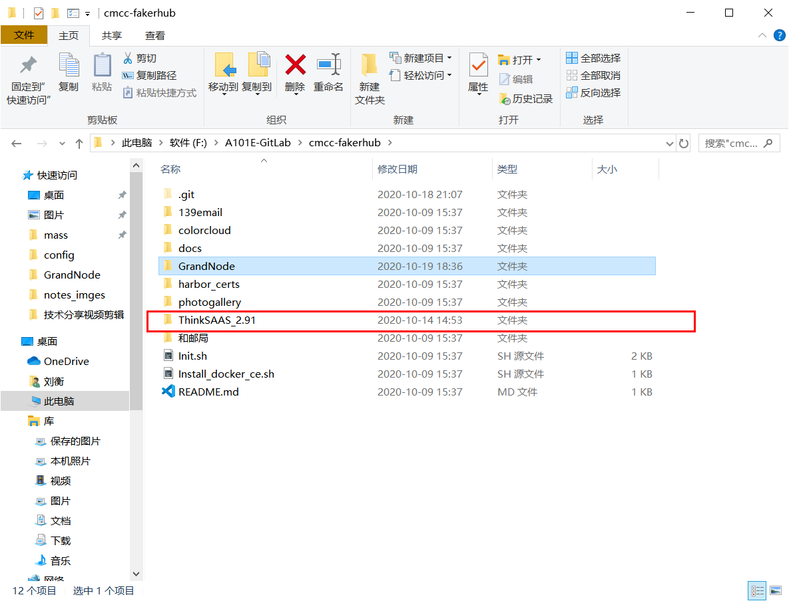
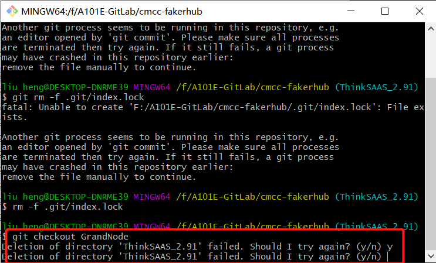
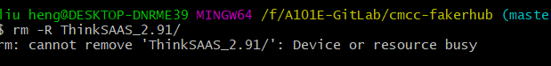

# 常用命令

- 良好的习惯：进行各种操作前一定要切换到相应的分支下
  - `git add`、`git commit`、`git push` 等操作要在 `.git` 文件所在目录下进行才生效

## 建立本地分支推送到远端

- 创建并切换分支：`git checkout -b local_branch`
- 新建的本地分支push到远程服务器：`git push origin local_branch:remote_branch` 或者 `git push origin remote_branch`
- 推送时跟踪远端分支：`git push --set-upstream origin remote_branch` 或者 `git push -u origin remote_branch`
- 本地分支和远程分支关联：`git branch --set-upstream-to origin/remote_branch`
- 查看本地分支与远端分支的关联情况：
  - `git branch -avv` // 查看本地分支的关联情况以及远程分支最新commit
  - `git branch -vv` // 查看本地分支的关联情况

- 删除指定的远程分支：
  - `git push origin :remote_branch`
  - `git push origin --delete remote_branch`
- 删除本地分支:
  `git branch -d local_branch`

## git 分支关联

- 本地已有分支，远端没有，将本地仓库分支**推送**到远端仓库  
  - `git push origin feature-branch:feature-branch`
  - 推送本地的 `feature-branch` （冒号前面的）分支到远程 `origin` 的`feature-branch`（冒号后面的）分支（没有会自动创建）

- 本地没有，远端有，本地仓库分支**关联**远端仓库分支（建立当前分支与远程分支的映射关系）
  - 创建并切换分支：`git checkout -b local_branch`  
  - 关联：`git branch -u origin/remote_branch`
  - 或者 `git branch --set-upstream-to origin/remote_branch`
  - 区别 `--set-upstream-to`（与 `-u` 等同？）、`--set-upstream` 区别

- 查看本地分支与远端分支的关联情况：
  - `git branch -avv` // 查看本地分支的关联情况以及远程分支最新commit
  - `git branch -vv` // 查看本地分支的关联情况

- 上述组合命令（本地没有分支，远端有分支，新建分支并切换，再关联远端分支）：  
`git checkout -b <branch> --track <remote(远端仓库地址（服务器）)>/<branch>`

- 网上看到的问题

    ```log
    // 别人遇到的问题，仅作参考
    There is no tracking information for the current branch.
    Please specify which branch you want to merge with.
    See git-pull(1) for details.

    git pull <remote> <branch>

    If you wish to set tracking information for this branch you can do so with:

    git branch --set-upstream-to=origin/<branch> release

    其实，输出的提示信息说的还是比较明白的。

    使用git在本地新建一个分支后，需要做远程分支关联。如果没有关联，git会在下面的操作中提示你显示的添加关联。

    关联目的是在执行git pull, git push操作时就不需要指定对应的远程分支，你只要没有显示指定，git pull的时候，就会提示你。

    解决方法就是按照提示添加一下呗：

    git branch --set-upstream-to=origin/remote_branch your_branch

    ```

- 关联远程仓库遇到的一个问题  

    ```shell
    $ git branch --set-upstream-to ThinkSAAS_2.91
    warning: Not setting branch ThinkSAAS_2.91 as its own upstream.
    ```

- 使用以下命令解决:  
  - `git branch --set-upstream-to=origin/remote_branch your_branch`
    - 其中，`origin/remote_branch` 是你本地分支对应的远程分支，`your_branch` 是你当前的本地分支。

  - 仔细查看，是因为缺少 `origin`，正确命令：  

    `git branch --set-upstream-to origin/ThinkSAAS_2.91`

  - 测试该命令最后一个参数：`your_branch` 能否省略
  - 已验证 `--set-upstream-to=` 中的等号可省略
  - 后两个参数（本地分支、远程分支）顺序存疑

- 关联以后同步远端仓库数据信息用到的命令
  - `git pull`
  - 其等于：`git fetch`+`git merge`

## git pull 与 git fetch + git merge

- 分支合并（远端master合并到本地分支、本地分支合并到远端master分支等操作练习）
- 实验楼
- `git pull`：
- `git fetch`：
- `git merge`：

## 多人协作（提交issues、PR）

- PR（Pull Requests）：理解
- 实验楼 系统学习

## 其他

- 版本回退
- tag
- logs、diff、rebase等不太常用命令
- 本地仓库添加多个远程仓库（给不同仓库命名/别名问题）
- 子模块、忽略一些文件（夹）

## 不同git版本命令略有区别

- 参考文献：[Git 1.7.0~1.8.0-用已存在的Git分支关联远程分支-CSDN-2019.03](https://blog.csdn.net/GarfieldEr007/article/details/88652277)

- 遇到的新问题

```log
liu heng@DESKTOP-DNRME39 MINGW64 /f/A101E-GitLab/cmcc-fakerhub (ThinkSAAS_2.91)
$ git checkout GrandNode
fatal: Unable to create 'F:/A101E-GitLab/cmcc-fakerhub/.git/index.lock': File exists.

Another git process seems to be running in this repository, e.g.
an editor opened by 'git commit'. Please make sure all processes
are terminated then try again. If it still fails, a git process
may have crashed in this repository earlier:
remove the file manually to continue.
```

- 参考：[Another git process seems to be running in this repository-stackoverflow-2020.09.21](https://stackoverflow.com/questions/38004148/another-git-process-seems-to-be-running-in-this-repository)

- 新问题
  - 问题描述：各分支出现一个多余的文件夹，删除不了，可能是切换分支不规范，切换分支某时有未保存的文件（text文件）没有及时保存关闭导致的
  - git报错：`rm:cannot remove 'ThinkSAAS_2.91/':Device or resource busy`
  - 具体原因未查
  - 截图
  
  
  
  - 解决办法：切回`master`分支，执行命令`rm -r ThinkSAAS_2.91/` 即可解决，或者直接选中文件右键删除
