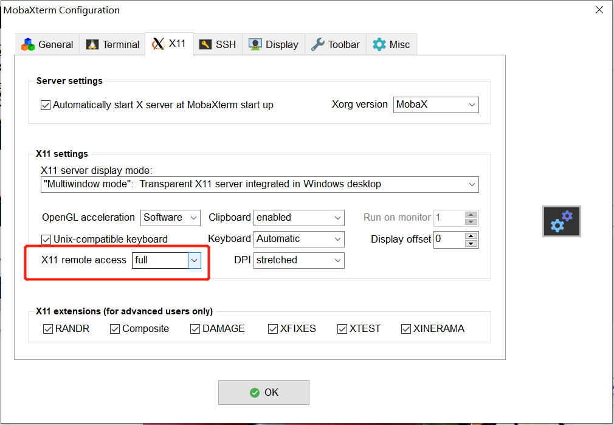
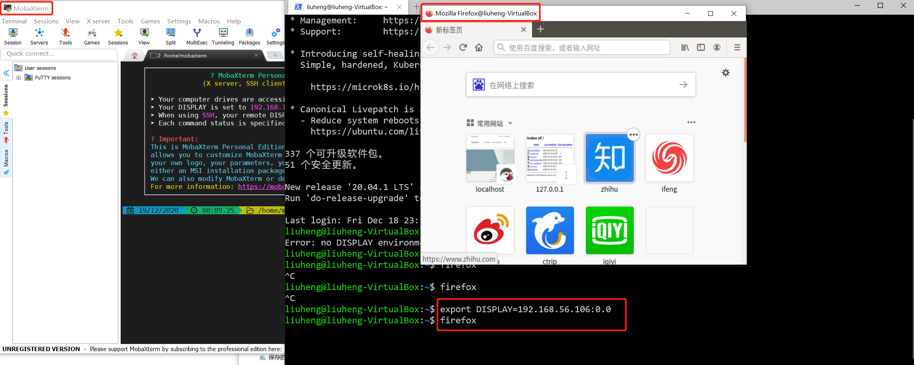

# Xserver简单了解

- 访问远程 Linux VM 上的 GUI 程序：`ssh -X username@<remote_ip>`
  - 前提是本地主机安装了 Xserver，尝试安装 Xserver 未成功，原理未理解清，遂放弃
  - 谨慎操作，特别是设置变量之类，避免进行自己不理解的操作，防止出现未知错误（不可预见）
  - 可借助 MobaXterm 自带的 X11 ，在 Settings-Configuration 中将 `X11 remote access` 设置为 `full`，并在连接上虚拟机的 bash 终端或者 windows terminal 导入变量 `export DISPLAY=localhost_ip:0.0`，再执行 GUI 程序（可执行程序）即可，例如：firefox
    - 注：`localhost_ip` 为本地主机 IP

    
    

**参考链接**  
[How can I export DISPLAY from a Linux terminal to a Windows PC?](https://superuser.com/questions/325630/how-can-i-export-display-from-a-linux-terminal-to-a-windows-pc)  
[What are X server, display and screen?](https://unix.stackexchange.com/questions/503806/what-are-x-server-display-and-screen/503884)  
[X11-DISPLAY（环境变量）](https://datacadamia.com/ssh/x11/display)  
[如何优雅的在Windows 10上装X](https://www.lainme.com/doku.php/blog/2018/07/%E5%A6%82%E4%BD%95%E4%BC%98%E9%9B%85%E7%9A%84%E5%9C%A8windows_10%E4%B8%8A%E8%A3%85x)