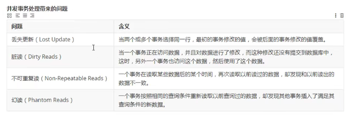

# MySQL 进阶学习笔记

参考教程：

- [MySQL教程](http://c.biancheng.net/mysql/)
- [MySQL保存包含单双引号数据方式](https://blog.csdn.net/yhcxy/article/details/106671636)
- [MySQL窗口函数](https://zhuanlan.zhihu.com/p/164698823)

## 1、索引

### 基本概念

索引是一种数据结构，例如 B+Tree，它以增加额外写入和存储为代价来提高表上数据检索的速度。

### 常用命令

建表语句见 [sql](./sql) 文件

- 创建索引：`create index idx_city_name on city(city_name);`
- 查看索引：`show index from city\G;`
- 删除索引：`drop index idx_city_name on city;`

#### `\g` 和 `\G` 的作用

- 在 MySQL 的 sql 语句后加上 `\g`，效果等同于加上定界符，一般默认的定界符是分号;
- 在 MySQ L的 sql 语句后加上 `\G`，表示将查询结果进行按列打印，可以使每个字段打印到单独的行。即将查到的结构旋转90度变成纵向（`\G`  来格式化输出信息）。

示例：`show index from city\G;`

```sql
*************************** 1. row ***************************
        Table: city
   Non_unique: 0
     Key_name: PRIMARY
 Seq_in_index: 1
  Column_name: city_id
    Collation: A
  Cardinality: 4
     Sub_part: NULL
       Packed: NULL
         Null:
   Index_type: BTREE
      Comment:
Index_comment:
      Visible: YES
*************************** 2. row ***************************
        Table: city
   Non_unique: 1
     Key_name: idx_city_name
 Seq_in_index: 1
  Column_name: city_name
    Collation: A
  Cardinality: 4
     Sub_part: NULL
       Packed: NULL
         Null:
   Index_type: BTREE
      Comment:
Index_comment:
      Visible: YES
2 rows in set (0.00 sec)
```

#### 使用 `alter` 命令创建索引

- 唯一索引： `alter table city add unique idx_city_name(city_name);` 这条语句创建索引的值必须是唯一的（列值唯一，可以有null，NULL可能会出现多次，其他值必须唯一）。

- 主键索引：`ALTER TABLE tbl_name ADD PRIMARY KEY (column_list)`: 该语句添加一个主键，这意味着索引值必须是唯一的，且不能为NULL
- 普通索引 `ALTER TABLE tbl_name ADD INDEX index_name (column_list)`: 添加普通索引，索引值可出现多次。
- 组合索引：多列值组成一个索引，专门用于组合搜索
- 全文索引（fulltext） 用于全文搜索 `ALTER TABLE tbl_name ADD FULLTEXT index_name (column_list)` 全文索引主要用来查找文本中的关键字，只能在 CHAR、VARCHAR 或 TEXT 类型的列上创建。在 MySQL 中只有 MyISAM 存储引擎支持全文索引。

- 以及修改删除等操作
  - 在 ALTER 命令中使用 DROP 子句来删除索引: `ALTER TABLE testalter_tbl DROP INDEX c;`
  - 修改索引: 在 MySQL 中修改索引可以通过删除原索引，再根据需要创建一个同名的索引，从而实现修改索引的操作。

### 使用 `ALTER` 命令添加和删除主键

主键作用于列上（可以一个列或多个列联合主键），添加主键索引时，你需要确保该主键默认不为空（`NOT NULL`）。实例如下：

```bash
mysql> ALTER TABLE testalter_tbl MODIFY i INT NOT NULL;
mysql> ALTER TABLE testalter_tbl ADD PRIMARY KEY (i);
```

你也可以使用 ALTER 命令删除主键：
`mysql> ALTER TABLE testalter_tbl DROP PRIMARY KEY;`

删除主键时只需指定PRIMARY KEY，但在删除索引时，你必须知道索引名。

### 索引设计原则


## 2、视图

视图定义：数据库视图是一个虚拟表或逻辑表，它被定义为带有[INNER](https://www.begtut.com/mysql/mysql-inner-join.html)（左连接右连接）的[SQL SELECT查询](https://www.begtut.com/mysql/mysql-select-statement-query-data.html)，视图也由列和行构成，但视图并不实际存在于数据库中。行和列的数据来自于定义视图的查询中所使用的表，并且还是在使用视图时动态生成的。

常用命令：

- 创建视图：`CREATE VIEW <视图名> AS <SELECT语句>`

  `create view view_city_country as select c.*,t.country_name from city c,country t where c.country_id
  =t.country_id;`

- 修改视图：`ALTER VIEW <视图名> AS <SELECT语句>`

- 查看视图：`show tables`、`desc ` <视图名>

- 查看视图的详细信息：`SHOW CREATE VIEW 视图名;`

- 删除视图：`DROP VIEW <视图名1> [ , <视图名2> …]`

  `DROP VIEW IF EXISTS v_students_info;`

## 3、存储过程和函数

- 存储过程是在数据库中定义一些 SQL 语句的集合，可以直接调用这些存储过程来执行已经定义好的 SQL 语句。避免了开发人员重复编写相同 SQL 语句的问题。

- 存储函数和存储过程一样，都是在数据库中定义一些 SQL 语句的集合。存储函数可以通过 return 语句返回函数值，主要用于计算并返回一个值。而存储过程没有直接返回值，主要用于执行操作

注意 handler 必须在游标后边声明

```sql
drop procedure pro_test12;
delimiter $
create procedure pro_test12()
begin
  declare e_id int(11);
  declare e_name varchar(100);
  declare e_age int(11);
  declare e_salary int(11);
  declare has_data int default 1;

  declare emp_result cursor for select * from emp;
  declare exit handler for not found set has_data=0;

  open emp_result;
    repeat
      fetch emp_result into e_id,e_name,e_age,e_salary;
      select concat('id=',e_id,'name=',e_name,'age=',e_age,'salary=',e_salary);
    until has_data=0
    end repeat;
  close emp_result;
  end$
delimiter ;
```

## 4、触发器

```sql
--insert触发器
drop trigger if exists emp_insert_trigger;
delimiter $
create trigger emp_insert_trigger
after insert 
on emp
for each row
begin
  insert into emp_logs(id,opertation,opertate_time,opertate_id,opertate_params) 
  values(null,'insert',now(),new.id,concat('插入后(id:',new.id,',name:',new.name,',age:',new.age,',salary:',new.salary,')'));
end$
delimiter ;

insert into emp(id,name,age,salary) values(null,'光明左使',30,3500);
select * from emp_logs;
```

## 5、存储引擎

- innoDB
- MyISAM
  - [MyISAM与InnoDB 的区别](https://blog.csdn.net/qq_35642036/article/details/82820178)
- MEMORY
- BDB

## 6、优化 SQL

### 优化 SQL 步骤

1. 查看 sql 执行频率，查看全局加上 global 关键字
  `select status like 'Com_______'`
  `select global status like 'Com_______'`
  `select status like 'Innodb_rows_%'`

2. 定位低效率 sql 语句

    - 慢查询日志
    - `show processlist` 实时查看低效率 sql

3. explain 分析执行计划

    - 对查找到的低效率 sql 语句，使用 explain 进行分析执行计划

4. show pofile分析sql

    show pofile 能够在做sql优化时帮助我们了解时间都耗费到哪了

    - 查看是否支持：`select @@have_profiling`
    - 查看是否开启：`select @@profiling`
    - 开启：`set profiling=1`（只针对当前会话生效）
    - 查看耗时统计：`show profiles$`
    - 查看详细耗时：`show profile for query query_id`、`show profile [cpu|all] for query query_id`

5. trace 分析优化器执行计划

### 索引的使用

1. 全值匹配：对索引中的所有列都指定具体值。该情况下，索引生效，执行效率高
2. 最左前缀法则：如果索引了多列，要遵守最左前缀法则，指的是查询从索引的最左前列开始，并且不跳过索引中的列，中间跳过索引中的列的话，按最左索引进行查找。
3. 范围查询右边的列，不能使用索引
`select * from tb_seller where name='华为技术有限公司1' and status>'0' and address='北京朝阳1号院'$`
此时右边的列 name 便不能使用索引去查找了！
4. 不要在索引上进行运算（使用函数之类）操作，索引将失效
`explain select * from tb_seller where substring(name,3,2)='aaa'$`
5. 字符串不加单引号，造成索引失效（虽然也能查到数据，原因是数据库底层对数据类型进行了隐式转换）
6. 尽量使用覆盖索引，避免使用 select *，避免回表查询
    - 覆盖索引：只访问索引的查询（索引列完全包含查询列），减少 select *。使用覆盖索引且where后使用了索引中的某个字段，会走索引，但是除了覆盖索引外还有其他字段则不走索引。
    `select name from tb_seller where name='华为技术有限公司1' and status='0' and address='北京朝阳1号院'$`
7. 用or分割开的条件，如果or前的条件中的列有索引，而后面的列中没有索引，那么涉及的索引都不会被用到，换成and则不会（使用最左匹配）。

8. 以% 开头的like模糊查询，索引失效。
    - 如果仅仅是尾部模糊匹配，索引不会失效，如果是头部模糊匹配，索引失效。
    - 解决方式：使用覆盖索引来查询
9. 如果MySQL评估使用索引比全表扫描慢，则不使用索引
10. is NULL、is NOT NULL 有时索引失效
11. in 走索引，not in不走索引（可能不绝对，待继续验证总结）
12. 单列索引和多列索引
    - 一个复合索引相当于创建了多个索引
      - `create index idx_seller_name_sta_addr on tb_seller(name,status,address);`
      一个复合索引相当于创建了三个索引
        - `name`
        - `name+status`
        - `name+status+adress`
    - 尽量使用复合索引，而少使用单列索引
    - 创建多个单列索引，数据库会选择一个最优的使用（辨识度最高的索引），并不会使用全部索引。

### 索引使用情况

- 当前会话：`show status like 'Handler_read%'`
- 全局会话：`show global status like 'Handler_read%'`

### SQL 优化

innodb类型的表

1. 大批量插入数据
    - 主键顺序插入
    - 关闭唯一性校验
    - 手动提交事务
2. 优化insert语句
    - 需要对用一张表插入很多行数据时，应该尽量使用多个值表的insert语句，这样会大大缩减客户端与数据库之间的连接、关闭等消耗
    - 在事务中进行数据插入
    - 数据有序插入

    ```sql
    start transaction
    insert into table_name(id,name) valuse(1,'bob')
    commit
    ```

3. 优化 order by 语句
    - order by 后跟索引字段
    - filesort，select * 时常常出现
    - using index 直接从索引字段返回数据，类似覆盖索引
    - order by 后面的字段要么都升序，要么都降序，order by 后面的字段顺序要和索引字段一致，否则的话需要额外的操作，这样就会出现 filesort
    - filesort 的优化，使用一次扫描算法，少用两次扫描算法。

4. group by的优化
    - 使用 order by null禁止排序
    - 使用索引

5. 嵌套查询（子查询）
    - 少用嵌套查询，多使用连接查询
    嵌套查询：`select * from t_user where id in (select user_id from user_role)`
    连接查询：`select * from t_user u, user_role ur where u.id=ur.user_id`

6. 优化or条件
    - 使用union替换or

    

7. 优化分页查询
    - 在索引上完成排序分页操作，最后根据主键关联回原表查询所需要的其他列内容
    `select * from user_info u,(select id from user_id order by id limit 2000000,10) a where u.id=a.id`
    - 该方案适用于主键自增的列，可以把limit查询转换成某个位置的查询，但是该方法不适合于存在断层的情况，比如id为10的列被删除了，结果就 不准确了
    `select * from user where id>2000000 limit 10`
8. 使用sql提示
    - use index 指定索引，希望mysql去参考的索引列表，就可以让mysql不再考虑其他可用的索引，数据库可能会根据底层算法自动判断使用索引还是使用全表扫描更快，但是force index
    `select * from tb_seller use index(ind_name) where name="huawei"$`
    - ignore index 忽略一个或者多个索引
    - force index 强制使用一个特定的索引
    `select * from tb_seller force index(index_adress) where address="北京朝阳1号院"$`

### 应用优化

1. 使用连接池
    - 建立连接的代价大，频繁的创建和关闭连接，比较消耗资源

2. 减少mysql的访问
    - 避免对数据进行重复检索，能够一次连接就获取数据的，就不用两次连接，减少无用的重复请求
    - 增加cache层
      - 部分数据从数据库中抽取出来放到应用端以文本的方式进行存储，或者使用框架（mybatis）提供的一级缓存/二级缓存
      - redis数据库

3. 负载均衡（非常普遍的优化方法）
    机制就是利用某种均衡算法，将固定的负载量分布到不同的服务器上，以此来降低单台服务器的负载，达到优化的效果
    - 利用mysql复制分流查询
       通过mysql的主从复制，实现读写分离，使增删改操作走主节点，查询操作走从节点，从而降低单台服务器的读写压力
       

    - 采用分布式数据库架构
      分布式数据架构适合大数据量、负载高的情况，它有良好的拓展性和高可用性，通过在堕胎服务器之间分布数据，可以实现在多台服务器之间的负载均衡，提高访问效率。

### 查询缓存优化

1. 概述：
  开启mysql的查询缓存，当执行**完全相同**的sql语句时，服务器就会直接从缓存中读取结果，当数据被修改时，之前的缓存会失效，修改比较频繁的表不适合做查询缓存。

2. 操作过程：
  

3. 查询缓存配置
4. 开启查询缓存
5. 查询缓存select选项

6. 缓存失效的情况
  

### 内存管理及优化

1. 优化原则
  

2. MyISAM 内存优化

3. innoDB 内存优化

### mysql 并发参数调整

1. max_connections：连接请求数
2. back_log：积压请求栈大小（存放超过max_connections大小的连接）
3. table_open_cache：可打开表缓存的数量
4. thread_cache_size：线程池
5. innodb_lock_wait_timeout：设置innoDB事务等待行锁的时间，对于需要快速反馈的业务系统来说，可以将行锁的等待时间调小，以避免事务长时间挂起，对于后台运行的批量处理程序来说，可以将行锁的等待时间调大，以避免发生大的回滚操作。

## 7、锁

锁是计算机协调多个进程或线程并发访问某一资源的机制（避免争抢）

### 分类

按粒度
  
- 行锁
- 表锁

按数据操作

- 读锁（共享锁）：同一份数据，多个读操作可以同时操作而不会相互影响
- 写锁（排他锁）：当前操作没有完成之前，会阻断其他写锁和读锁

### mysql 锁机制


### MySIAM 表锁

- 加锁：`lock table table_name read/write`
- 解锁:  `unlock tables`

结论：读锁会阻塞写，但是不会阻塞读，而写锁，则即会阻塞读，又会阻塞写。

MySIAM 的读写锁调度是写优先，这也是MySIAM 不适合做写为主的表的存储引擎的原因，因为写锁后，其他线程不能做任何操作，大量的更新会使查询很难得到锁，从而造成永久阻塞。

- 查看锁的争用情况：命令略

### innoDB 行锁

innoDB 默认支持行锁


#### 并发可能存在的问题

- 丢失更新
- 脏读
- 不可重复读
- 幻读



#### 事务隔离级别

- 读未提交: 读未提交就是每次事务执行的修改都更新到对应的数据上，然后读取直接读取这个数据就可以了。在该隔离级别，所有事务都可以看到其他未提交事务的执行结果
- 读已提交: 一个事务只能看见已经提交事务所做的改变，换句话说就是事务提交之前对其余事务不可见。
- 不可重复读（默认）：即：事务A在读到一条数据之后，此时事务B对该数据进行了修改并提交，那么事务A再读该数据，读到的还是原来的内容。
- 串行化


#### 行锁分类

- 共享锁（S） 读锁 S锁
- 排他锁（X） 写锁 X锁

对于update、delete、insert语句，innoDB自动给涉及的数据集加排他锁
select语句 不加锁

数据库默认自动提交事务，关闭自动提交：`set autocommit=0`，改为手动提交：`commit`

#### 无索引行锁升级为表锁

如果不通过索引条件检索数据，那么innoDB将对表中的所有记录加锁，实际效果跟表锁一样。

例如：执行更新时，name字段本来为vachar类型，我们却作为数值类型使用，存在类型转换，所以失效，最终行锁变表锁。

#### 间隙锁危害

当使用范围条件（而不是相等条件）检索数据时，并请求共享锁和排他锁时，innoDB会给符合条件的的已有数据进行加锁；对于键值在条件范围但并不存在的记录，叫做“间隙（GAP）”，innoDB也会对这个“间隙”加锁，这种锁机制就是间隙锁（Next-Key 锁）

#### innoDB行锁争用情况

#### 总结


## 8、常用 SQL 技巧

### 执行顺序

`from, including joins > on > where > group by > having > select > distinct > union > order by > limit`

### 正则表达式使用

`select * from user where name regexp '^j'`

### 常用函数

- 数值型函数
- 字符串函数，字符串索引从1开始
- 日期和时间函数
- **聚合函数**
  - COUNT(*) 计算表中总的行数，无论某列有数值或者为空值。
  - COUNT（字段名）计算指定列下总的行数，计算时将忽略空值的行。

- 流程控制函数

参考：
[MySQL常用函数汇总](http://c.biancheng.net/mysql/function/)

## 8、日志

## 9、案例

## 继续学习

- onion 查询
- 事务
- where in 等关键字，子查询
  - where id in ("1",'2')
  - where id = (select user_id from a where role_id=3)

- [MySql数据库连接池专题](https://www.cnblogs.com/aspirant/p/6747238.html)