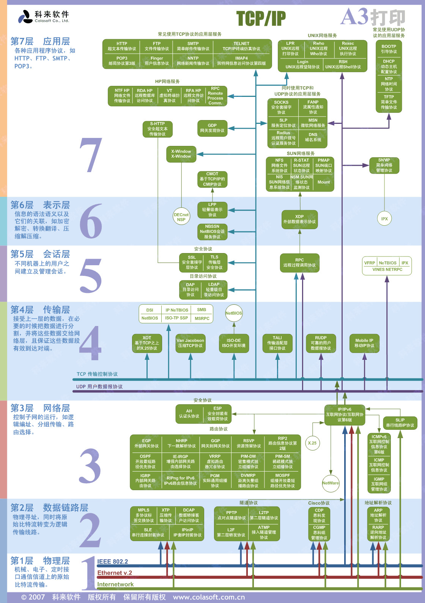

# socket/websockt/http 区别

TCP/IP 协议族中的各个协议在OSI模型中的分布

- [ ] 待继续补充

共同点：

- 基于 TCP/IP 协议

不同点：

- http 短链接（一般为几分钟就关闭）、无状态（需要借助请求头 cookie等字段） tcp 三次握手 b/s模式 请求才回复
- websocket 长链接 需要维护一段内存来保持连接 一直建立除非关闭浏览器，全双工通信 单次握手
- socket 套接字 host+端口号  长连接  是对TCP/IP协议的封装，Socket本身并不是协议，而是一个调用接口（API），通过Socket，我们才能使用TCP/IP协议。

简单参考

- [Http、Socket、WebSocket](https://cdmana.com/2022/03/202203280217410200.html)
- [TCP、Socket、WebSocket、HTTP](https://zhuanlan.zhihu.com/p/51279572)
- [WebSocket于HTTP 、WebSocket与Socket的区别](https://jayqiu.github.io/blog/2017/05/blog_05_13_10.html)
- [使用Go语言创建WebSocket服务](https://segmentfault.com/a/1190000022034813)
- [Go语言基础之网络编程](https://www.liwenzhou.com/posts/Go/15_socket/)
- [Go实战 No.027 Go干货！WebSocket服务器](https://mp.weixin.qq.com/s/PYSdPawd1G8iWClq22mpqg)
- [Go语言Socket编程详解](http://c.biancheng.net/view/4513.html)
- [WebSocket 教程](https://www.ruanyifeng.com/blog/2017/05/websocket.html)