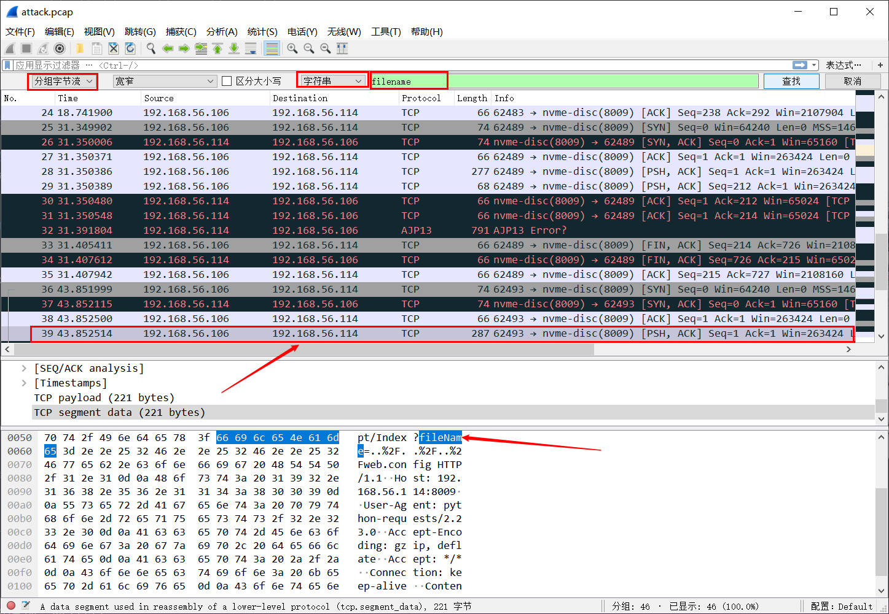
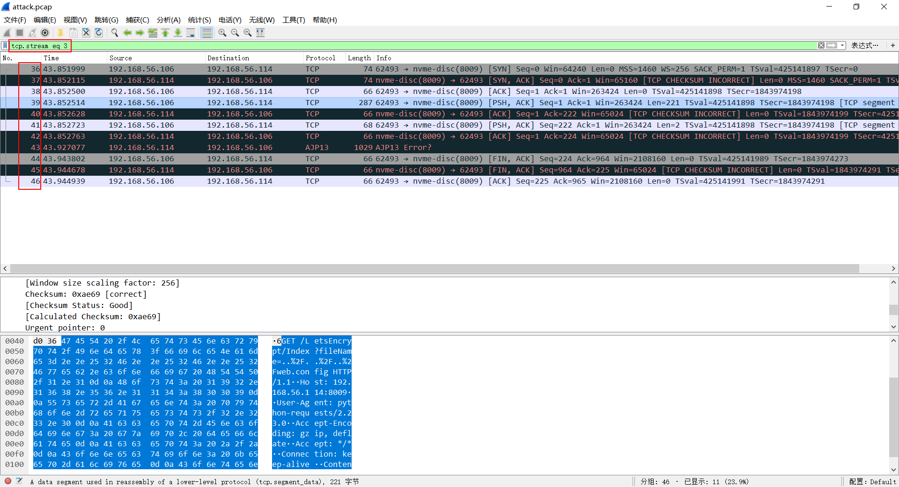
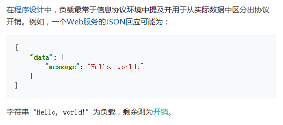
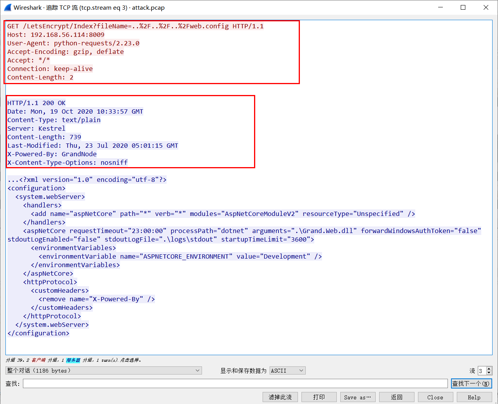

# wireshark小技巧

- 搜索指定字符串
  - 编辑-查找分组-按分组字节流 && 字符串查找
  
  - **注意**：一些符号被浏览器进行编码了，如：`/`被编码成`%2F`
  - 在JavaScript，PHP和ASP中，可以使用一些函数对URL进行字符串编码。
  - [ASCII编码参考](https://www.w3schools.com/tags/ref_urlencode.ASP)：浏览器将根据页面中使用的字符集对输入进行编码

- 追踪流
  - `tcp.stream eq 3`：此处的`3`代表序号无实际意义
  - 一个tcp流含有多个数据包，如：`tcp.stream eq 3`包含多个数据包
  

  **参考链接**  
  [TCP 的数据流](https://sites.google.com/site/jishutaolun/network/tcp-data-stream)  
  [TCP/IP 通信传输流——掘金——201905](https://juejin.im/post/6844903840148373518)  
  [TCP/IP 数据流与数据包——CSDN](https://blog.csdn.net/linux_hacher/article/details/77847158)

- `payload`理解
  - “有效载荷，有效负荷，有效载重”

  - 维基百科：
  > 在计算机科学与电信领域，负载（英语：Payload）是数据传输中所欲传输的实际信息，通常也被称作实际数据或者数据体。信头与元数据，或称为开销数据，仅用于辅助数据传输。在计算机病毒或电脑蠕虫领域中，负载指的是进行有害操作的部分，例如：数据销毁、发送垃圾邮件等。
  - wiki举例（翻译版）：
  

  - 此处理解：包含`http header`，（此处注意区分IP（协议）数据报`header`），具体可跟踪tcp流，可以看到`http header`等内容在`payload`中  
    

  **参考链接**  
  [Payload (computing)-wiki](https://en.wikipedia.org/wiki/Payload_(computing))  
  [代码参数里的 payload 是什么意思???——简书-201803](https://www.jianshu.com/p/1bf3456a396a)

- 过滤器更多语法规则见参考链接  

  **参考链接**  
  [Wireshark User’s Guide-Version 3.3.2](https://www.wireshark.org/docs/wsug_html_chunked/)  
  [wireshark过滤语法总结——CSDN-201112](wireshark过滤语法总结)  
  [wireshark过滤规则及使用方法——201704](https://blog.csdn.net/wojiaopanpan/article/details/69944970)